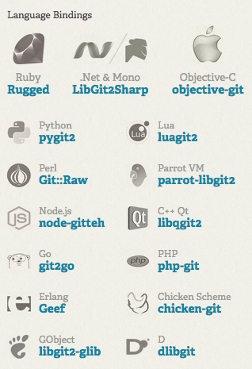

class: center, middle

# GIT 的未来
## Libgit2 的前世今生


.footnote[XTao 2014.06.21 .red[夏荷听雨]]

???
1. 其实我也不知道什么是未来
2. 大胆的猜测，我所能看到的项目当中
3. 为 Libgit2, Pygit2 提过 Patch
4. 在豆瓣全职写过 CODE

---
# 目录

1. GIT 的简介
2. Libgit2 的简介
3. GIT 的哲学
4. Libgit2 能做什么
5. 展望未来

???
1. GIT 与 Libgit2
2. 不会深入讲 GIT 与 Libgit2 的结构
3. 一些思考

---

# GIT 是什么意思

分布式版本控制系统?

Decentralized Version Control System (DVCS)?

--

在英国俚语中指一个愚笨或者不开心的人

Dictionary: unpleasant person

Man: the stupid content tracker

Linus 自嘲:

    I'm an egotistical bastard, and I name all my projects after myself.
    First Linux, now git.

???
1. GIT 的文字含义
2. 考究

---

# GIT

    GNU General Public License version 2

    Git was initially designed and developed by Linus Torvalds
    for Linux kernel development in 2005.

???
1. 版权 GPLv2
2. 从 2005 年开始，最先用的是 bitkeeper，由于授权问题，导致无法在继续使用

---
# GIT 历史

```bash
commit e83c5163316f89bfbde7d9ab23ca2e25604af290
Author: Linus Torvalds <torvalds@ppc970.osdl.org>
Date:   Thu Apr 7 15:13:13 2005 -0700

    Initial revision of "git", the information manager from hell
```

--

```bash
xtao@Taos-MacBook-Air ~/Work/code/git $ ls -al
total 64
drwxr-xr-x 14 xtao staff  476 Jun 18 20:54 .
drwxr-xr-x 68 xtao staff 2312 May 30 20:39 ..
drwxr-xr-x 14 xtao staff  476 Jun 18 20:54 .git
-rw-r--r--  1 xtao staff  957 Jun 18 20:54 Makefile
-rw-r--r--  1 xtao staff 8392 Jun 18 20:54 README
-rw-r--r--  1 xtao staff 2484 Jun 18 20:54 cache.h
-rw-r--r--  1 xtao staff  503 Jun 18 20:54 cat-file.c
-rw-r--r--  1 xtao staff 4103 Jun 18 20:54 commit-tree.c
-rw-r--r--  1 xtao staff 1198 Jun 18 20:54 init-db.c
-rw-r--r--  1 xtao staff 5681 Jun 18 20:54 read-cache.c
-rw-r--r--  1 xtao staff  986 Jun 18 20:54 read-tree.c
-rw-r--r--  1 xtao staff 2034 Jun 18 20:54 show-diff.c
-rw-r--r--  1 xtao staff 5395 Jun 18 20:54 update-cache.c
-rw-r--r--  1 xtao staff 1441 Jun 18 20:54 write-tree.c
```

???
1. Linus 的写的第一个 GIT 的 commit

---
# GIT 历史

```bash
xtao@Taos-MacBook-Air ~/Work/code/git $ find . -name "*.[ch]"| xargs wc -l
   93 ./cache.h
   23 ./cat-file.c
  172 ./commit-tree.c
   51 ./init-db.c
  259 ./read-cache.c
   43 ./read-tree.c
   81 ./show-diff.c
  248 ./update-cache.c
   66 ./write-tree.c
 1036 total
```

???
1. 其实从文件中，可以看出，一开始他就不会成为一个库 T_T

---
# GIT 命令

```bash
xtao@localhost ~ $ ls -l ~/gentoo/usr/libexec/git-core/ | wc -l
165
```

## 类型

* porcelain
* plumbing

???
1. 大约有 200 个 GIT 命令
2. GIT 命令分为 2 种类型

---

# Porcelain

.center[]

* git-commit
* git-fetch
* git-submodule
* ...

???
1. 日常所使用的命令
2. 输出是人们可读字符
3. 由了管道命令构成

---

# Plumbing

.center[]

* git-for-each-ref
* git-diff-files
* git-checkout-index
* ...

???
1. 底层命令
2. 大多数命令，我们不必关心

---
# API

```bash
$ git cat-file commit HEAD^{commit}
$ git show --format=...
```

???
1. GIT 命令举例

---
background-image: url(img/libgit2-doc.png)

---
background-image: url(img/libgit2-doc1.png)

---
# Libgit2 的由来

Libgit 在哪里?

--

## libgit.a

libgit.a in GIT.

* All about memery
* OOM

???

1. GIT 中确实存在可以链接的库
2. 但是内存消耗十分严重
3. GIT 没有默认释放内存，导致 OOM
4. 需要重置全局变量
5. 有个叫 cgit 的项目尝试通过 CGI 的方式改变这种状况

* Link and are happy until you look at your memory consumption.
* Git doesn't free most of its memory → OOM
* Need to re-set global variables
* cgit manages to do this with CGI, but c'mon.

---
# GIT 代码问题

* 界面和通用代码紧耦合
* 大量的 die()

???

1. Git's code is tightly coupled between generic and UI.
2. 一旦出现问题，就退出了，这对于 CLI 是没有问题的

---
# 历史

```bash
commit c15648cbd059b92c177586ab1701a167222c7681
Author: Shawn O. Pearce <spearce@spearce.org>
Date:   Fri Oct 31 09:57:29 2008 -0700

    Initial draft of libgit2

    Signed-off-by: Shawn O. Pearce <spearce@spearce.org>
```

--

```bash
xtao@Taos-MacBook-Air ~/Work/code/libgit2/src $ ls -alh
total 24K
drwxr-xr-x 7 xtao staff  238 Jun 18 20:57 .
drwxr-xr-x 9 xtao staff  306 Jun 18 20:57 ..
-rw-r--r-- 1 xtao staff 2.7K Jun 18 20:57 git_common.h
-rw-r--r-- 1 xtao staff 1.8K Jun 18 20:57 git_odb.c
-rw-r--r-- 1 xtao staff 4.8K Jun 18 20:57 git_odb.h
-rw-r--r-- 1 xtao staff 3.2K Jun 18 20:57 git_oid.c
-rw-r--r-- 1 xtao staff 2.6K Jun 18 20:57 git_oid.h
```

???

1. 第一个提交
2. 一开始就是清晰的
---
# 历史

```bash
xtao@Taos-MacBook-Air ~/Work/code/libgit2 $ find . -name "*.[ch]"| xargs wc -l
   83 ./src/git_common.h
   43 ./src/git_odb.c
  133 ./src/git_odb.h
   73 ./src/git_oid.c
   76 ./src/git_oid.h
  408 total
```
---
# Libgit2 结构

* core
* config
* odb
* refdb
* network

???
1. 模块化，对象化

---
# Libgit2 API

```c
git_repository_init(&repo, "projects/foo");

git_repository_open(&repo, "projects/foo.git", 1);
```

???
1. 对外提供 C 函数和C 对象

---
# Libgit2 的现状

* 实现了核心 GIT 命令
 * commit
 * tag
 * ref
 * blob
 * merge
 * pack
* 没有实现 server 端
* 没有 porcelain 命令
* 少许的内存泄漏
* 一些与 GIT 命令不一致的地方，最终会一致的
* 命令参数还没有 GIT 的丰富
* 缺少一些实用性的 hack, 这应该是应用层次的问题
 * git clone --shared
* 重构会引发 bug, ORZ...
* 用来加速 Web 应用足够，但是替代 GIT 还需时日

---

# Libgit2 bindings

.center[]

???
1. 丰富的第三方绑定
2. 我们在大量的使用 Pygit2
3. Github 的 rugged

---
# 一些其他的实现
* cgit

A hyperfast web frontend for git repositories written in C.

* dulwich

Named after the town Mr & Mrs Git live in Monty Python sketch.
"Pure" python, bunch of it in C.

* Jgit

Java

???
1. cgit 仅仅只是个 Web 端
2. dulwich 实现了 server 端，但是我们没有采用
3. Jgit Java 实现，与 Libgit2 开始的时间差不多，没有看过代码，不清楚具体情况，但是很多项目都在用。 同时也有人想要 Libgit2 的 java binding

---
background-image: url(img/logo-code.png)
# Libgit2 的用户

.center[]


.right[]

.center[]

???
1. TortoiseGit and GitExtensions are slowly adopting libgit2.
2. GitHub uses it for gists, some features in .com and the native apps (parts)
3. Visual Studio, WebMatrix, TFS all use libgit2. VS uses libgit2sharp exclusively.
4. Plastic switches it around, originally fast-import and recreate repo, with lg2# we can negotiate and only import what we need.
5. CODE

---
# GIT 哲学

* 分布式
* 小仓库
* 跟随操作系统
* 进程模型

---
# GIT 带来了什么

* 方便切换上下文
 * stash
 * index
 * branch
* 提升协作效率
 * merge
 * pull
 * push
 * pull request

---
# 展望未来

* Blob
 * 支持比 blob 更小的存储对象?
* Center
 * 会不会增加一些中心化的特性，比如元数据支持，用来处理大仓库问题?
* System
 * 会不会增加一些系统属性，比如说规定提交日志的编码类型为 UTF-8 ?
* Libgit2
 * Libgit2 在未来会不会替代 GIT 的核心功能?
 * 实现 server 端的功能
* GIT2
 * 一个采用 Libgit2 实现 GIT 命令的项目?
* Maria/Flask-Maria
 * Python GIT Server?

一条优雅的路径，当然首先，他是工作的。

???
1. GIT 的使命
2. 一个清晰的结构
3. 服务端的实现
4. HG & Facebook
6. Perforce & Google
---
### 豆瓣 - 和有意思的⼈做有意思的事情

#### 产品开发工程师 (Python)
#### 移动产品开发工程师 (Android 方向)

.center[]

.right[推荐请发送至: ruby@douban.com]

.right[豆瓣招聘小站 http://site.douban.com/Jobs/]

.right[GitHub https://github.com/hellorubyworld/join]
